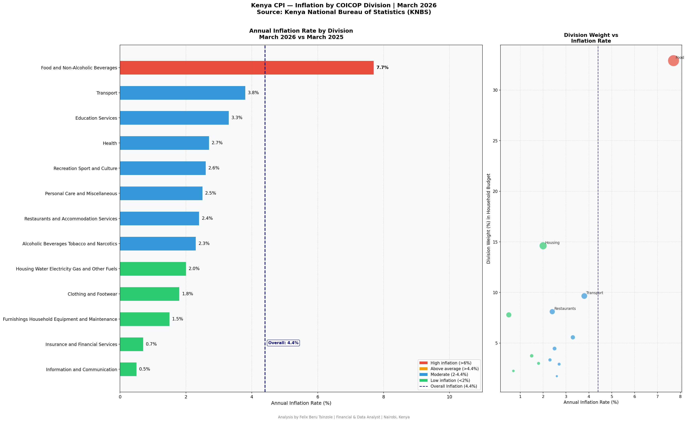
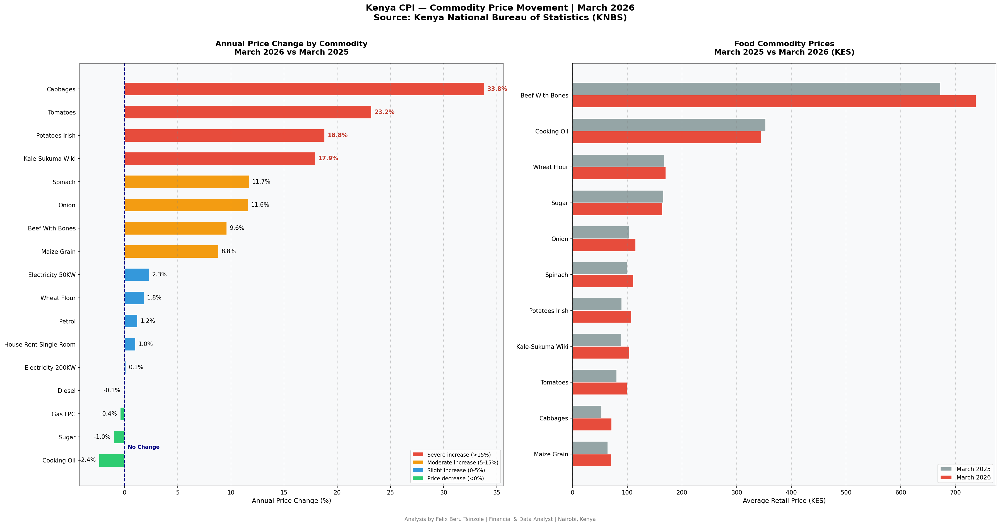
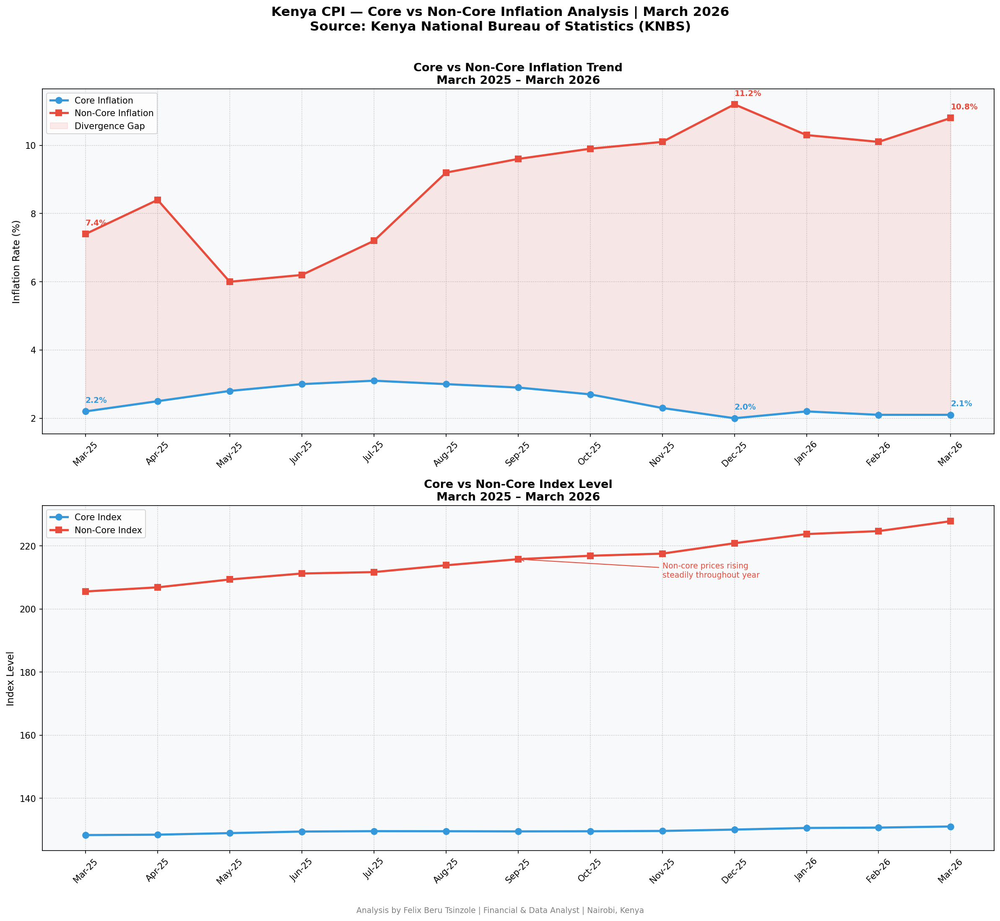
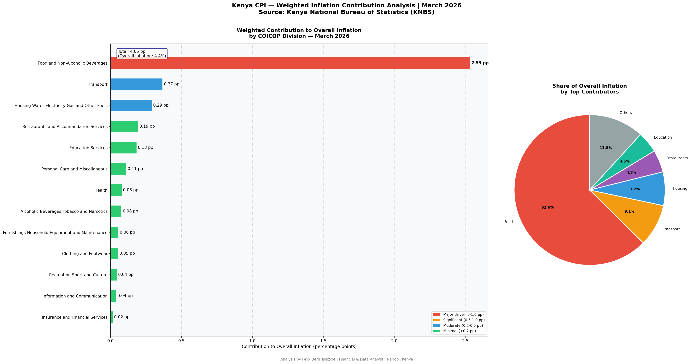

# 🇰🇪 Kenya Consumer Price Index (CPI) & Inflation Analysis
## March 2025 – March 2026

**Analyst:** Felix Beru Tsinzole | Financial & Data Analyst | Nairobi, Kenya  
**Data Source:** Kenya National Bureau of Statistics (KNBS) — CPI Report March 2026  
**Tools:** Python • Pandas • Matplotlib • Google Colab • GitHub

---

## Project Overview

This project presents a comprehensive financial analysis of Kenya's
Consumer Price Index (CPI) and inflation trends for the period
March 2025 to March 2026, using official data published by the
Kenya National Bureau of Statistics (KNBS).

The analysis is structured as a professional financial research report —
moving from raw data through cleaning, analysis and visualization
to actionable business insights.

---

## The Headline Finding

> *Food and Non-Alcoholic Beverages alone contributes **2.53 percentage points**
> to Kenya's overall 4.4% inflation rate — accounting for **62.6% of total inflation**
> despite being just one of 13 expenditure divisions.*

---

## Key Findings

### 1. Overall Inflation
- Overall inflation rate (March 2026): **4.4%**
- Monthly change (March/February 2026): **0.5%**

### 2. Core vs Non-Core Divergence
- Core inflation (March 2026): **2.1%** — stable and low
- Non-core inflation (March 2026): **10.8%** — high and persistent
- Divergence gap: **8.7 percentage points**
- Peak non-core inflation: **11.2%** in December 2025

> Kenya does not have a structural inflation problem.
> The crisis is entirely driven by food and energy price shocks.

### 3. Top Inflation Drivers by Division
| Division | Annual Inflation | Weight |
|---|---|---|
| Food and Non-Alcoholic Beverages | 7.7% | 32.9% |
| Transport | 3.8% | 9.6% |
| Education Services | 3.3% | 5.6% |

### 4. Weighted Contribution to Overall Inflation
| Division | Contribution | Share of Total |
|---|---|---|
| Food and Non-Alcoholic Beverages | 2.534 pp | 62.6% |
| Transport | 0.367 pp | 9.1% |
| Housing Water Electricity Gas | 0.292 pp | 7.2% |
| Restaurants and Accommodation | 0.194 pp | 4.8% |
| Education Services | 0.184 pp | 4.5% |

### 5. Commodity Price Highlights
**Biggest annual price increases:**
| Commodity | March 2025 | March 2026 | Change |
|---|---|---|---|
| Cabbages | KES 53.46 | KES 71.52 | +33.8% |
| Tomatoes | KES 80.88 | KES 99.60 | +23.2% |
| Potatoes | KES 90.22 | KES 107.16 | +18.8% |

**Price decreases:**
| Commodity | March 2025 | March 2026 | Change |
|---|---|---|---|
| Cooking Oil | KES 353.01 | KES 344.50 | -2.4% |
| Sugar | KES 166.08 | KES 164.37 | -1.0% |
| Gas LPG | KES 3,146.03 | KES 3,132.34 | -0.4% |

---

## Visualizations

### Chart 1 — Inflation by Division

### Chart 2 — Commodity Price Movement

### Chart 3 — Core vs Non-Core Inflation Trend

### Chart 4 — Weighted Contribution Analysis

---

## Business Implications

For businesses operating in rural Kenya — particularly those
with loan-to-own models serving low-income households:

1. **Collections risk** — rising food costs reduce household
   disposable income available for loan repayments
2. **Value proposition strengthens** — as energy costs rise,
   affordable solar alternatives become more attractive
3. **Pricing sensitivity** — rural consumers are more price
   sensitive than ever
4. **Opportunity** — counties where food inflation is highest
   represent the strongest market opportunity for cost-saving products

---

## Methodology

Weighted contributions calculated using:
**Weighted Contribution = (Division Weight / 100) × Annual Inflation Rate**

Total weighted contribution of 4.05 pp vs reported 4.4% —
0.35 pp rounding difference attributable to KNBS index
calculation methodology.

---

## Repository Structure

| File | Description |
|---|---|
| `kenya_cpi_inflation_analysis.ipynb` | Full annotated Python notebook |
| `kenya_cpi_divisions.csv` | CPI by 13 COICOP divisions |
| `kenya_cpi_commodities.csv` | 17 commodity retail prices |
| `kenya_cpi_core_noncore.csv` | Core vs non-core monthly data |
| `kenya_cpi_divisions_chart.png` | Division inflation chart |
| `kenya_cpi_commodities_chart.png` | Commodity price movement chart |
| `kenya_cpi_core_noncore_chart.png` | Core vs non-core trend chart |
| `kenya_cpi_weighted_chart.png` | Weighted contribution chart |

---

## Author
**Felix Beru Tsinzole** | Financial & Data Analyst | Nairobi, Kenya

[![Dashboard]
